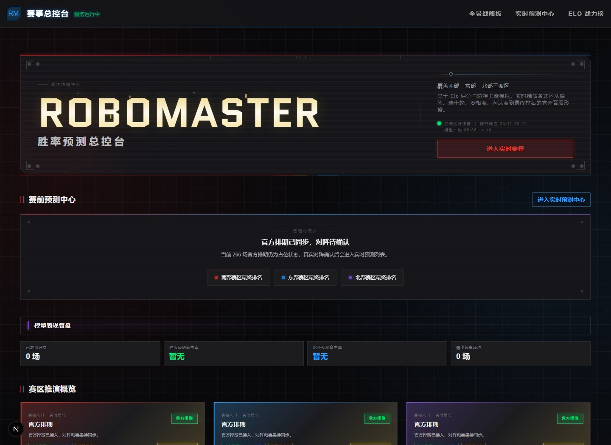
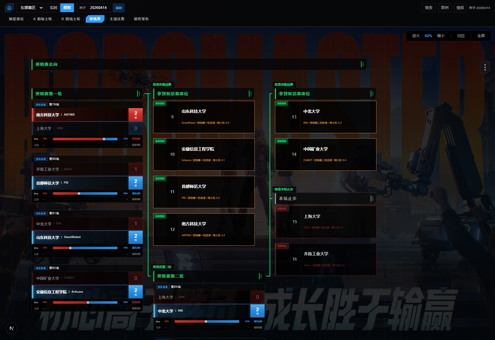

# 斗蛐蛐 - RoboMaster 胜率预测总控台

本项目响应 *电控-000* 的号召，开发一套面向 RoboMaster 赛事的胜率预测网站，用于赛程模拟、实时状态聚合、战队胜率评估与晋级路径推演。项目全程使用 Codex 和 DeepSeek + Claude Code 搭建。

斗蛐蛐的目标不是做一个通用数据后台，而是做一个更贴近 RoboMaster 观赛和赛程分析场景的赛事总控台：用户可以从首页快速看到各赛区走势，也可以进入赛区画布查看每一轮比赛、晋级去向、胜负概率、实时状态与队伍情报。

## 核心能力

- **赛前胜率预测**：基于 Elo / TrueSkill2 / Monte Carlo 模拟结果，展示单场比赛胜率、赛区晋级概率、国赛概率、复活赛概率与夺冠概率。
- **赛程画布推演**：使用自定义静态画布展示抽签、瑞士轮、资格赛、主淘汰赛和最终排名，保留赛程分支、连线、队伍卡片与胜负状态。
- **实时与模拟双模式**：支持 `live` 实时模式和 `sim` 模拟模式；实时源不可用时会在界面中明确提示，并降级到模拟沙盘。
- **队伍情报追踪**：每支队伍都有独立档案页，集中展示 Elo、概率指标、已赛路径、后续对手和最终落位。
- **模型复盘与数据新鲜度**：首页和实时预测中心会展示模型表现、官方数据同步情况、待开赛/已完赛状态和数据源更新时间。

## 项目画面

### 主页画面



### 赛程画布画面



## 网页功能介绍

### 全景战略板

路径：`/`

主页是整个系统的总入口，面向“先看全局，再进入细节”的使用方式。它会聚合展示赛事总控台、赛前预测中心入口、模型表现复盘、各赛区推演概览和赛区强度对比。

主要功能：

- 展示 RoboMaster 胜率预测总控台主视觉和当前数据状态。
- 显示官方排期、对阵确认、实时赛程或模拟沙盘入口。
- 展示模型表现复盘，包括预测命中、比分偏离、爆冷等统计。
- 以赛区卡片形式展示南部、东部、北部赛区的晋级形势和关键队伍。
- 提供到实时预测中心、Elo 战力榜、赛区沙盘和队伍档案的跳转入口。

### 实时预测中心

路径：`/forecast-center`

实时预测中心用于集中查看“现在和接下来应该关注哪些比赛”。页面会轮询实时接口，结合官方赛程状态和模型预测结果，按赛区与比赛状态筛选对阵。

主要功能：

- 按赛区筛选：全部赛区、南部、东部、北部。
- 按比赛状态筛选：全部状态、正在进行、即将开赛、尚未开赛、过期未同步。
- 展示数据源新鲜度，帮助判断当前预测是否已经接入官方实时数据。
- 显示下一场需要关注的比赛和对应赛区。
- 展示实时预测面板和模型复盘面板，便于赛中快速判断重点对阵。

### Elo 战力榜

路径：`/elo-rankings`

Elo 战力榜用于横向比较各赛区队伍实力。页面按赛区组织队伍排行，展示当前 Elo、赛季初变化、区域排名、全局排名和概率指标。

主要功能：

- 按南部、东部、北部赛区分栏展示战力排行。
- 展示队伍当前 Elo 与赛季初 Elo 变化。
- 展示赛区排名、全局排名和强度摘要。
- 从队伍条目跳转到对应战队档案页。
- 作为赛程预测之外的实力基准，用于辅助判断爆冷、强弱对阵和赛区整体强度。

### 赛区工作区

路径：`/regions/[region]`

示例：

- `/regions/south_region?view=slots&mode=live`
- `/regions/east_region?view=qualification&seed=20260414`
- `/regions/north_region?view=final-rankings&seed=20260414`

赛区工作区是本项目最核心的交互页面。它用一张可缩放、可拖拽、可全屏的赛程画布，展示单个赛区从抽签到最终排名的完整推演。

主要功能：

- 支持赛区切换：南部赛区、东部赛区、北部赛区。
- 支持模式切换：实时模式和模拟模式。
- 支持模拟种子输入与刷新，便于复现或重新生成模拟结果。
- 支持视图切换：抽签落位、A 组瑞士轮、B 组瑞士轮、资格赛、主淘汰赛、最终排名。
- 支持队伍搜索，搜索结果可以直接定位到赛区画布并打开队伍情报。
- 支持图例面板，展示待验证、已完赛、精准预测、比分偏离、路线爆冷等状态说明。
- 支持情报面板，点击队伍或比赛后查看队伍概率、路径、对阵详情、胜率解释和 Elo 变化。
- 支持 URL 深链参数 `seed`、`highlight`、`view`、`mode`，方便分享某个固定视角。

### 赛区工作区视图

| 视图 | 参数 | 功能 |
| --- | --- | --- |
| 抽签落位 | `view=slots` | 查看 A、B 两组的抽签位置、种子分布和开局站位。 |
| A 组瑞士轮 | `view=swiss-a` | 按轮次查看 A 组从开局到出线或出局的完整路径。 |
| B 组瑞士轮 | `view=swiss-b` | 按轮次查看 B 组从开局到出线或出局的完整路径。 |
| 资格赛 | `view=qualification` | 逐轮展示资格赛分流结果，明确谁进入国赛、复活赛或止步。 |
| 主淘汰赛 | `view=playoff` | 展示 16 进 8、8 进 4、半决赛、季军战与冠军战主链路。 |
| 最终排名 | `view=final-rankings` | 按最终名次回看国赛、复活赛和其余队伍落位。 |

### 战队档案

路径：`/teams/[teamKey]`

战队档案页用于查看单支队伍的完整状态。用户可以从首页赛区卡片、Elo 战力榜、赛区画布情报面板或搜索结果进入该页面。

主要功能：

- 展示队伍所属赛区、高校名、队名、当前 Elo 和赛季初变化。
- 展示国赛概率、复活赛概率和最终落位。
- 展示已赛路径，包括每场对手、时间、比分和胜负状态。
- 展示预测路径，包括后续可能对手、对手 Elo、胜率和阶段信息。
- 提供返回赛区沙盘的入口，并在画布中高亮当前队伍。

## 页面与数据链路

- 前端页面通过 `frontend/lib/api.ts` 请求后端接口，默认后端地址为 `http://127.0.0.1:8001`。
- 后端 FastAPI 聚合模拟结果、官方实时赛程、小程序预测与派生数据。
- TS2 / Monte Carlo / 赛区模拟产物由 `research/trueskill2/`、`scripts/` 和 `data/derived/` 维护。
- 赛程画布由 `frontend/lib/canvas-builders.ts` 构建，阶段和结果中文映射由 `frontend/lib/display.ts` 统一处理。

本仓库包含：

- `frontend/`：Next.js App Router 前端。
- `backend/`：FastAPI 聚合与模拟接口。
- `research/trueskill2/`、`scripts/`、`data/derived/`：评分、模拟与发布产物流水线。

## 本地开发

后端默认监听 `127.0.0.1:8001`：

```powershell
.venv-win\Scripts\uvicorn.exe backend.app.main:app --host 127.0.0.1 --port 8001
```

前端默认监听 `127.0.0.1:3005`：

```powershell
cd frontend
npm run dev
```

常用校验：

```powershell
cd frontend
npm test
npm run build
```

## 引用与致谢

本项目参考并引用了 scutrobotlab 的 RoboMaster 赛程分析相关开源仓库：

- https://github.com/scutrobotlab/rm-schedule-ui
- https://github.com/scutrobotlab/rm-schedule

两个上游仓库均以 Apache License 2.0 开源。更完整的第三方署名见 `NOTICE`。

## 许可证

本项目以 Apache License 2.0 开源，见 `LICENSE`。
